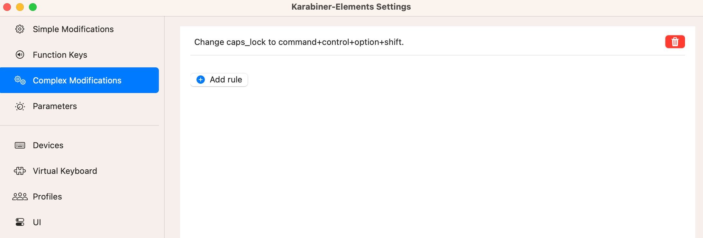

# MacOS Tips and Softwares

## 1. MacOS Tips
拿到电脑之后，最好能做下面的几个调整，让自己用起来更舒服：

* Setting -> Mouse -> Tracking Speed, 根据需要调整
* Setting -> Trackpad -> Tap to click (tap with one finger)。这样就可以轻触实现点击，不用每次都把触摸板按下去了
* Setting -> Accessibility -> Pointer Control -> Trackpad Options -> Dragging style -> Three Finger Drag。这样就可以实现3指拖动窗口了
* Setting -> Control Center -> Battery -> Show Percentage. 显示电量百分比
* Setting -> Desktop & Dock。根据自己需要调整，建议调整size, magnification, 和Automatically hide and show the dock

其他的根据自己喜好调整。

##  2. MacOS Softwares
下面是推荐安装的一些软件：

### VPN client

鉴于网络环境的差异，建议首先安装VPN软件，根据自己的需要选择

> Cisco AnyConnect Secure Mobility Client
> 
> ClashX Pro

### brew

> https://brew.sh/

首先安装brew, 之后的很多软件可以在brew里直接安装，比自己一个一个下载，然后安装要方便很多。


### 在brew里直接安装的软件

``` #!/bin/bash

########### Brew Install List ###########
brew install blueutil
brew install ffmpeg
brew install git
brew install handbrake
brew install lux
# brew install node
# brew install openconnect
brew install python@3.11
brew install wget

########### Brew Cask Install List ###########
brew install --cask appcleaner
brew install --cask baidunetdisk
brew install --cask bluesnooze
brew install --cask foxitreader
brew install --cask foxmail
brew install --cask free-download-manager
brew install --cask gimp
brew install --cask hammerspoon
brew install --cask iina
brew install --cask iterm2
brew install --cask karabiner-elements
brew install --cask koodo-reader
brew install --cask macdown
brew install --cask neteasemusic
brew install --cask omnidisksweeper
brew install --cask onyx
# brew install --cask openconnect-gui
brew install --cask raycast
brew install --cask sublime-text
brew install --cask vlc
brew install --cask xnviewmp

echo "And done..."
```

## 3. MacOS全局快捷操作

使用karabiner-elements 和 HammerSpoon配合，可以实现如下功能：

* 快捷键在多个屏幕之间挪动程序
* 快捷键调整程序窗口大小
* 快捷键调整屏幕亮度、音量大小
* 快捷键打开程序、切换程序窗口

> https://karabiner-elements.pqrs.org/
> 
> https://www.hammerspoon.org/

karabiner-elements里HyperKey的设置：



HammerSpoon可以参考这里的配置：
> https://github.com/zfdang/hammerspoon-config

```
HyperKey: {"cmd", "alt", "ctrl", "shift"}

HyperKey + l: lock screen

HyperKey + b: show battery status on screen

HyperKey + [: move app to left screen

HyperKey + ]: move app to right screen

HyperKey + return: maximize current window

HyperKey + left: resize current window to the left half of the screen

HyperKey + right: resize current window to the right half of the screen

HyperKey + up: resize current window to the top half of the screen

HyperKey + down: resize current window to the bottom half of the screen

HyperKey + x: launch application by x (see key2App in key-bindings.lua, you can customize it in your own way)

{"CMD","Ctrl"} + up: volume up

{"CMD","Ctrl"} + down: volume down

{"option","Ctrl"} + up: screen brightness up

{"option","Ctrl"} + down: screen brightness down
```

